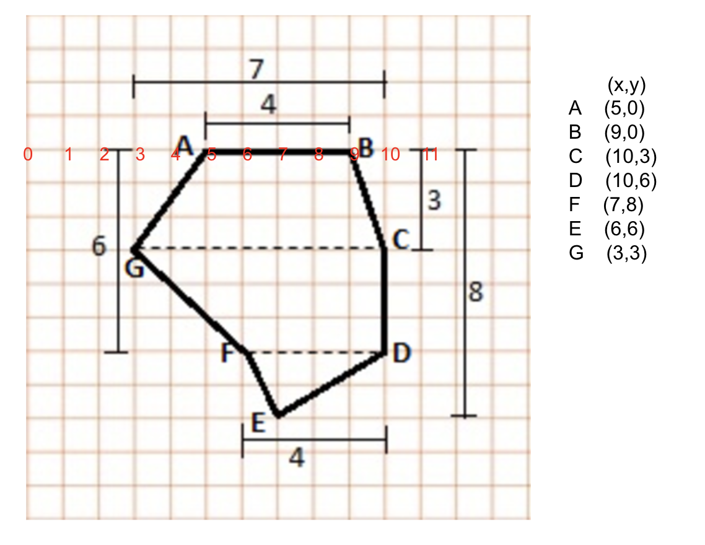

# Shoelace Algorithm for Computing Area of Polygon

**Original paper:** 

*Meister, A. L. F. (1769), "Generalia de genesi figurarum planarum et inde pendentibus earum affectionibus"*
```
/*
 * points are stored in the counter-clockwise order.
 * (x0,y0) --> (x1,y1) --> (x2,y2) --> (x3,y3) --> (x4,y4) --> (x0,y0)
 * The points array only needs to contain points (x0,y0)...(xn,yn).
 * It is assumed that the last point is connected with the first one.
 *
 *           1  |                               |
 *  Area =  --- | Σ (x_i * y_i+1 - x_i+1 * y_i) |
 *           2  |                               |
 */
```

**Test points**

Example is taken from [link](https://byjus.com/maths/area-of-polygon/) and the result is 37.


